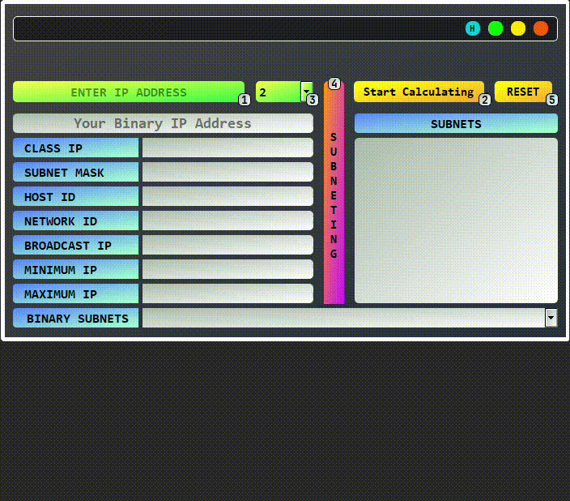

# Iptx
Iptx (IP Tool X) is an complete IP calculator built in Python with a beautiful Gui, just enter your IP and press the start calculating button, you can get information such as Ip class, subnet mask, host ID, etc, I hope you like it


# Requires
```bash
  pip install PyQt5
```

# Features 
- Class IP
- Subnet Mask
- Host ID
- Network ID
- Broadcast IP
- Minimum IP
- Maximum ID
- Subneting
- IP binary address

# Usage/Examples
<kbd>
 
</kbd>


# Author
- Github: [@Ayminjf](https://github.com/Ayminjf)
- Twitter: [@Ayminjf](https://twitter.com/Ayminjf)


